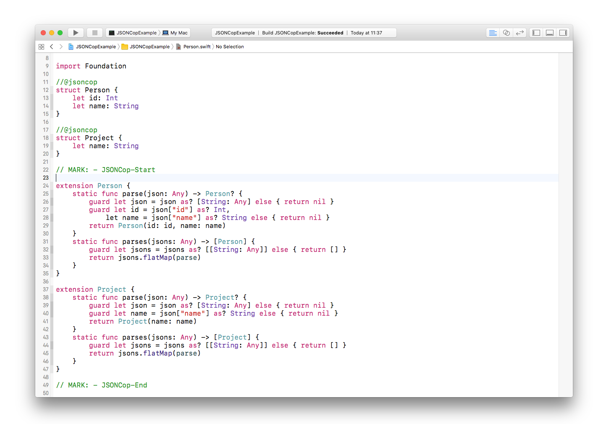

# JSONCop

[](https://github.com/draveness/jsoncop/blob/master/LICENSE)
[](http://rubygems.org/gems/jsoncop)
[](https://img.shields.io/badge/Swift-%203.0%20-yellow.svg)

JSONCop makes it easy to write a simple model layer for your Cocoa and Cocoa Touch application.

> JSONCop's APIs are highly inspired by [Mantle](https://github.com/Mantle/Mantle), you can use similar APIs to generate parsing methods with JSONCop.

```swift
let json: [String: Any] = [
    "id": 1,
    "name": "Draven",
    "createdAt": NSTimeIntervalSince1970
]
let person = Person.parse(json: json)
```

## Usage

Define a model with and implement `static func JSONKeyPathByPropertyKey` method:

```swift
// jsoncop: enabled

struct Person {
    let id: Int
    let name: String
    let createdAt: Date

    static func JSONKeyPathByPropertyKey() -> [String: String] {
        return [
            "id": "id",
            "name": "name",
            "createdAt": "createdAt"
        ]
    }

    static func createdAtJSONTransformer(value: Any) -> Date? {
        guard let value = value as? Double else { return nil }
        return Date(timeIntervalSinceNow: value)
    }
}
```

> DO NOT forget to add "// jsoncop: enabled" before struct.

Run `cop install` in project root folder.

```shell
$ cop install
```

This will generate several parsing methods in current file without affecting other part of your codes:



All the code between `generate-start` and `generate-end` and will be replaced when re-run `cop install` in current project folder. Other codes will remain unchanged. Please don't write any codes in this area.

## Installation

```
sudo gem install jsoncop --verbose
```

## Contributing

Bug reports and pull requests are welcome on GitHub at https://github.com/draveness/jsoncop. This project is intended to be a safe, welcoming space for collaboration, and contributors are expected to adhere to the [Contributor Covenant](http://contributor-covenant.org) code of conduct.


## License

The gem is available as open source under the terms of the [MIT License](http://opensource.org/licenses/MIT).
